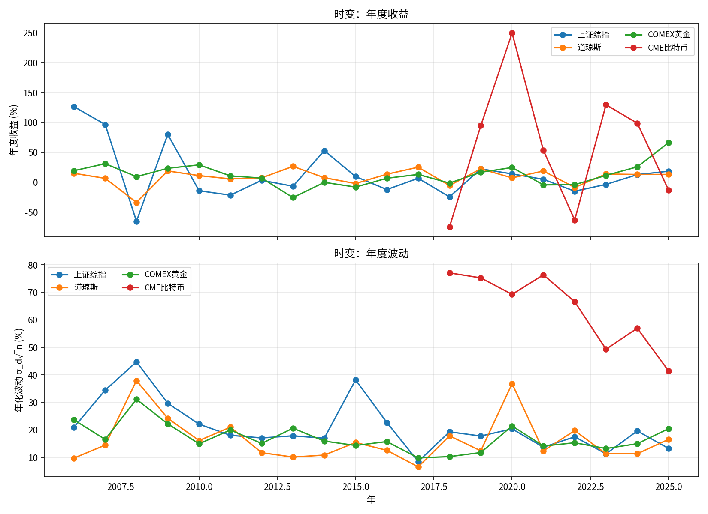
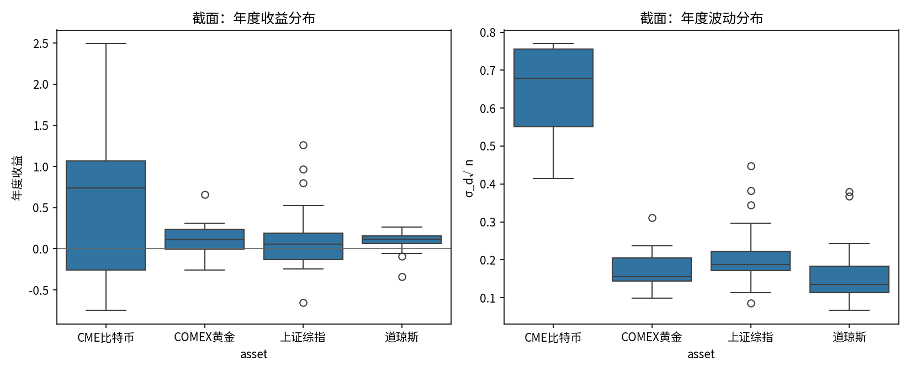
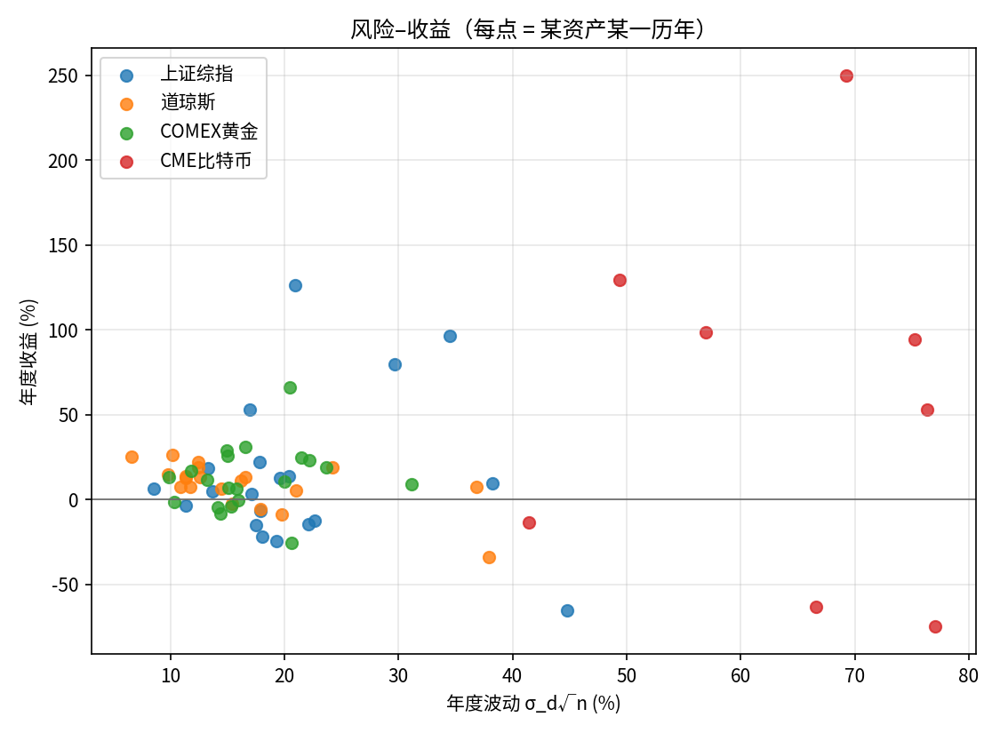
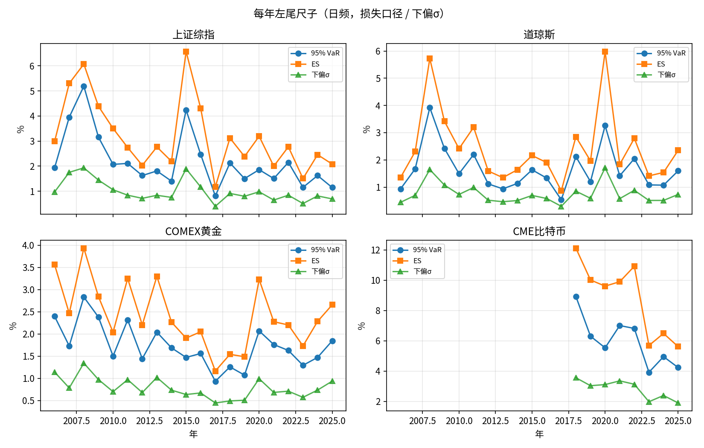
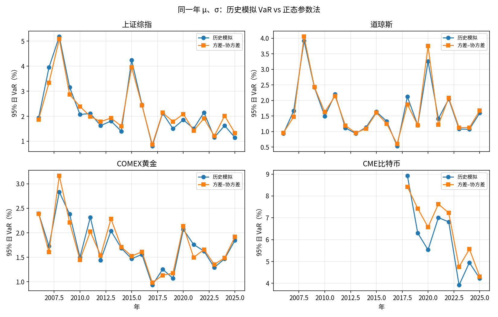
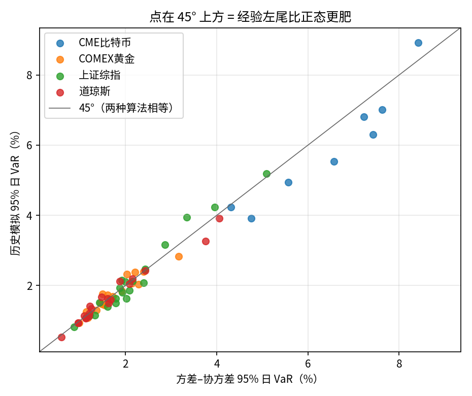
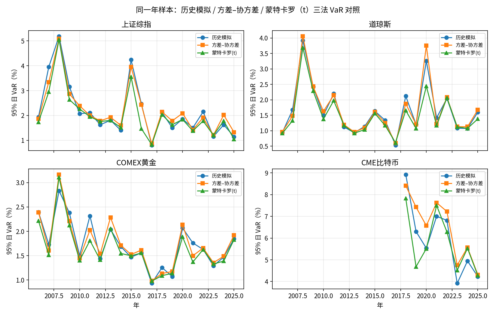
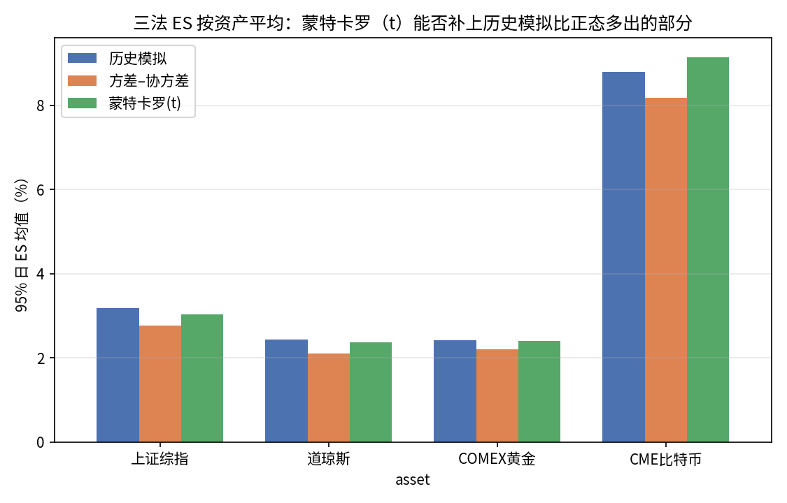
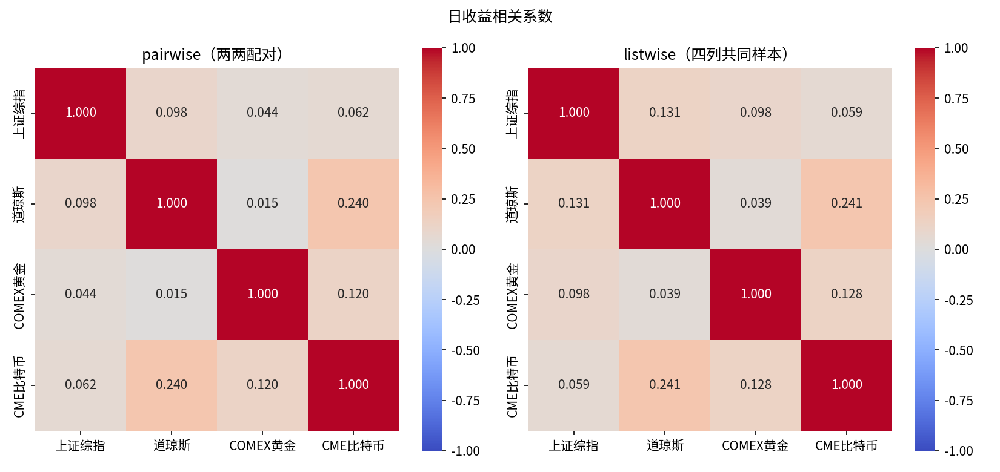
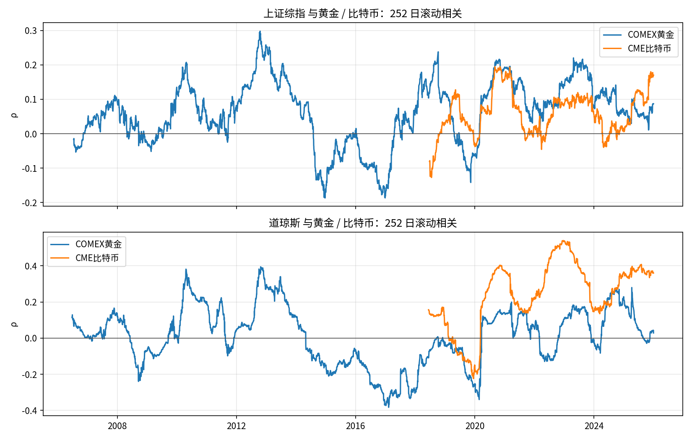

# 摘要 {.unnumbered}

> **分工说明**：本报告的数据处理、代码实现与文本撰写均由邓权艺（学号 202311140038）独立完成；按实验要求第 5 条，已与组员童萌（学号 202411030113）互相核对关键结果（条目见附录第 7 节）。

本报告以上证综合指数（SSCI）、道琼斯工业平均指数（DJI）、COMEX 黄金连续合约与 CME 比特币期货 2006—2025 年（比特币自 2017 年 12 月上市起）的日频收盘价为样本，按课程给定口径计算四类资产的年度收益、年度波动率、95% 日风险价值（VaR）、期望损失（ES）与下偏标准差，并在历史模拟法之外补充方差–协方差参数法与蒙特卡罗（Student-$t$ 过程）模拟作为交叉验证。主要发现如下：

1. 四类资产的收益与波动均呈现明显的时变性，2008、2015、2020、2025 等年份在各资产上留下可辨识的印记。
2. 就截面而言，比特币的收益均值与波动率显著高于其余三类资产，上证综指的年际波动约为道琼斯的三倍，风险与收益并不总是同向排序。
3. 历史模拟法与方差–协方差法给出的 95% 日 VaR 在多数年份相差有限，但历史模拟法的 ES 在左尾偏肥的年份（如 2015 年上证综指）明显高于正态假设下的理论值；进一步以逐年拟合的 Student-$t$ 过程重新模拟后，ES 在四类资产上均较正态假设更接近历史模拟的结果，而 95% VaR 几乎不受影响，说明这一差异确由收益分布的肥尾特征而非抽样噪声驱动，且仅凭 VaR 无法充分刻画左尾风险的形状。
4. 相关性分析表明，黄金与股票市场的全样本相关系数接近零，大跌日表现分化，只能构成有限的分散化工具，其避险效应并不稳定；比特币与道琼斯的相关系数在大跌日进一步上升且自身收益转负，更符合顺周期风险资产的特征，对股票市场不具备避险功能。

# 引言

在同一组合中配置股票、贵金属与数字资产能否降低整体风险，取决于三个层面的经验事实：

- 其一，各类资产的收益与风险本身是否随时间显著变化，即**时变性**；
- 其二，在给定历史窗口内，不同资产的风险—收益特征在**截面**上是否存在系统性差异；
- 其三，各类资产之间的相关结构在正常时期与股票市场剧烈下跌时期是否保持稳定——这直接决定了某一资产能否被称为股票市场的"避险资产"。

本报告围绕上证综指、道琼斯、COMEX 黄金与 CME 比特币期货 2006—2025 年的日频价格数据，依次从收益与波动的时变 / 截面特征（第 3 节）、基于历史模拟法的尾部风险度量（第 4 节）、以及资产间相关性与避险效应（第 5 节）三个角度展开分析，并以方差–协方差参数法与蒙特卡罗模拟对历史模拟的结果做交叉验证，检验正态假设是否足以刻画各类资产收益的左尾风险、厚尾特征能否解释其中的差异。**全部代码与中间结果见 <https://github.com/aylmerwawa/investments-lab1-return-risk>**，本报告仅保留口径说明、关键代码片段与结论性图表。

# 数据与方法

## 数据来源与样本区间

数据取自课程发放的 `实践1数据-股指黄金比特币-2006至今.xlsx`。样本自 2006-01-01（或该品种首个交易日）起，至题面截止日 **2025-12-31** 止；文件中另有延伸至 2026 年的行情，为避免把未满年的 2026 与完整历年混入同一张年表，一律截断。@tbl-sample 汇总四类资产的样本区间与交易日数。黄金采用 `GC00.CMX` 连续合约以保证时间序列的连续性；比特币采用 `BTC.CME`，自 2017-12-18 起有连续报价。年度指标要求该年日收益样本量不少于 20 条，故比特币 2017 年（不足一个月数据）不进入年度统计表。课件另给出蓝字“原理版”（2024-01-01 至 2025-12-31 的两年子样本），notebook 中可一键切换，正式提交采用完整的 20 年窗口。将数据文件置于仓库根目录，在 conda 环境 `ml` 中对 `作业.ipynb` 执行 Run All 即可复现全部结果。

| 资产 | 代码 | 起始 | 结束 | 交易日 |
|------|------|------|------|--------|
| 上证综指 | 000001.SH | 2006-01-04 | 2025-12-31 | 4859 |
| 道琼斯 | DJI.GI | 2006-01-03 | 2025-12-31 | 5031 |
| COMEX 黄金 | GC00.CMX | 2006-01-03 | 2025-12-31 | 4919 |
| CME 比特币 | BTC.CME | 2017-12-18 | 2025-12-31 | 2022 |

: 四类资产的样本区间与有效交易日数 {#tbl-sample}

## 收益率与波动率的度量

日简单收益定义为

$$
r_t = \frac{P_t}{P_{t-1}} - 1 .
$$

**年度收益**按日历年、收盘到收盘计算：将该年全部日收益连乘，即 $R_y=\prod_t(1+r_t)-1$；若已知上年末收盘价，等价于 $R_y=P_{\text{年末}}/P_{\text{上年末}}-1$。样本不含 2005 年数据，故 2006 年仅能用当年首末收盘计算，与其余年份口径略有差异，在解读 2006 年数值时需留意。

**年度波动率**取该年日收益的样本标准差（`ddof=1`）再年化。主表采用 $\sigma_{\mathrm{d}}\sqrt{n}$（$n$ 为该年实际的日收益样本量），这一做法在闰年、节假日调整或数据缺失导致 $n$ 偏离 250 时更为精确；另给出课件常用的 $\sigma_{\mathrm{d}}\sqrt{250}$ 平方根法则作为对照，两者数值差异一般在 1% 以内。

## 风险价值、期望损失与下偏标准差的度量

**95% 日 VaR（历史模拟法）**不假设收益服从特定分布，而是把该年已实现的日收益视为其经验分布，取 5% 分位数 $q_{0.05}$ 作为分位点估计；正文统一采用**损失口径** $\mathrm{VaR}_{5\%}=-q_{0.05}$，即 VaR 为正数表示当日可能损失的幅度。

**期望损失（ES）**取课件给定的条件期望定义：

$$
\mathrm{ES}_{5\%}=E\!\left[r \mid r\le q_{0.05}\right],
$$

即左尾（收益低于 VaR 分位点）全部观测的平均收益，报告中同样取其相反数以对应损失口径。ES 度量的是"一旦跌破 VaR，平均会亏多少"，因而比单一分位点的 VaR 更能反映左尾的肥瘦程度。

**下偏标准差**以该年日均收益 $\bar r$ 为阈值，只统计低于均值的部分：

$$
\sigma_D=\sqrt{\frac{1}{N-1}\sum_t \max(0,\ \bar r-r_t)^2} .
$$

## 相关系数与避险效应的界定

若某资产对股票市场具有**避险（hedge）**效应，需满足两个条件：股票市场大跌时，该资产的条件相关系数为负；且在大跌日该资产自身的平均收益为正。仅仅全样本相关系数接近零，只能说明该资产提供了一定的**分散化**效果，尚不足以称为避险；若相关系数为正，则更接近同一风险因子的暴露，对冲股票市场下跌的作用有限。相关性的主表采用**两两配对（pairwise）**方式计算，使黄金仍可利用 2006—2025 的完整重叠样本；同时给出四列同时非空的**共同样本（listwise）**相关系数作为对照，以避免比特币 2017 年底上市后才存在的截断样本影响对黄金—股票关系的判断。

# 收益与风险的时变性与截面特征

将每一个日历年视为一个观测单位，可以分别从**时间序列**与**截面**两个维度比较四类资产的收益与风险特征。@tbl-cross-section 给出以年度为观测单位的截面统计：道琼斯的年均收益最低但年际波动最小，风险调整后的稳定性最好；上证综指的收益均值高于道琼斯，但年际标准差约为其三倍，反映出更强的时变性与政策 / 情绪驱动特征；黄金的收益与波动居中；比特币样本仅 8 年，均值与波动率均明显高出其余三类资产一个数量级，与其市场发展阶段和投机属性相符。

| 资产 | 年数 | 收益算术平均 | 年际 $\sigma$ | 最差一年 | 正收益年占比 |
|------|------|--------------|---------------|----------|--------------|
| 道琼斯 | 20 | 8.7% | 13.7% | $-33.8\%$（2008） | 80% |
| 黄金 | 20 | 12.4% | 19.0% | $-25.8\%$（2013） | 70% |
| 上证 | 20 | 14.2% | 44.7% | $-65.4\%$（2008） | 60% |
| 比特币 | 8 | 59.3% | 108% | $-75.0\%$（2018） | 62.5% |

: 以年度为观测单位的截面统计（收益算术平均、年际标准差按年度收益序列计算） {#tbl-cross-section}

时变性首先体现在危机与主题性年份上：2008 年全球金融危机中，上证综指下跌 $65\%$、道琼斯下跌 $34\%$；2020 年比特币受流动性宽松与机构入场推动上涨 $250\%$；2025 年黄金上涨 $66\%$，同期股票收益虽同为正但涨幅远不及黄金，反映出该年度避险与再通胀交易的叠加影响。就波动率而言，比特币的年度波动约为上证综指的三倍、道琼斯的四倍。@fig-ret-ts 展示四类资产历年收益与年化波动的时间路径，@fig-ret-box 将各年份摊开为箱线图以呈现截面分布及离群年份，@fig-ret-scatter 则以风险—收益平面中的散点呈现"某资产 $\times$ 某一年"的联合分布，可见比特币的点位整体位于右上方，风险与收益同步偏高。

按年分组后，年收益取该年日收益的连乘积，年化波动取日标准差乘以 $\sqrt{n}$：

```python
annual_return = (1 + r).prod() - 1
sigma_year = r.std(ddof=1) * np.sqrt(n)
```

完整明细见 `结果/01-年度收益与标准差.xlsx`、`结果/01b-截面摘要.xlsx`。

```{=latex}
\Needspace{16\baselineskip}
```

{#fig-ret-ts width=80%}

{#fig-ret-box width=80%}

{#fig-ret-scatter width=58%}

# 基于历史模拟法的风险度量及其交叉验证

## 历史模拟法：VaR、ES 与下偏标准差

历史模拟法不对收益分布做参数假设，而是将该年已实现的日收益直接当作经验分布：排序后取第 5 百分位数即为 95% 日 VaR；一年约有 244 个交易日，左尾对应约 12—13 个观测，ES 取这些观测的均值（再取相反数得到损失口径）。核心计算如下：

```python
q = float(np.quantile(r, 0.05))
tail = r[r <= q]
var_loss = -q
es_loss = float(-tail.mean())
```

以损失口径计，2008 年上证综指的 95% 日 VaR 为 $5.19\%$、ES 为 $6.07\%$；2015 年 VaR 降至 $4.24\%$，低于 2008 年，但 ES 反而升至 $6.57\%$：该年分位点上的损失幅度虽不及 2008 年，可一旦跌破分位点，左尾之外的平均损失反而更为严重——这正是仅凭 VaR 容易忽视、而 ES 能够捕捉的"尾中之尾"风险。2017 年市场波动率整体偏低，VaR 仅为 $0.81\%$。@fig-var-year 给出四类资产历年 95% VaR、ES 与下偏标准差的时间路径，三条曲线在危机年份同步抬升，且 ES 始终位于 VaR 之上，与其定义一致。

```{=latex}
\Needspace{14\baselineskip}
```

{#fig-var-year width=82%}

## 拓展：方差–协方差参数法对照

题面要求的主表为历史模拟法，此处补充方差–协方差参数法作为交叉验证：仍用同一年的日收益样本估计 $\mu,\sigma$，进一步假设 $r\sim N(\mu,\sigma^2)$，则

$$
q_{0.05}^{\mathrm{VC}}=\mu+z_{0.05}\sigma,\qquad
z_{0.05}=\Phi^{-1}(0.05)\approx -1.645 ,
$$

$$
\mathrm{ES}_{0.05}^{\mathrm{VC}}=\mu-\sigma\,\frac{\phi(z_{0.05})}{0.05}.
$$

在 95% 这一并不十分极端的置信水平上，两种方法给出的 VaR 在多数年份相差有限——上证综指的历史模拟 VaR 与方差–协方差 VaR 的样本均值分别约为 $2.19\%$ 与 $2.20\%$，几乎重合。但两种方法在 ES 上的差异明显更大：2015 年上证综指历史模拟 ES 为 $6.57\%$，而正态假设下的闭式 ES 仅为 $4.98\%$，相差约 1.6 个百分点，说明该年经验分布的左尾比正态分布更"肥"，仅用 VaR 无法察觉这一差异。课件在处理短持有期问题时常令 $\mu=0$；在日频数据下，多数年份 $\mu$ 相对 $\sigma$ 可忽略不计，含 $\mu$ 与否差异很小，但 2008 年上证综指日均收益 $\mu=-0.39\%$ 幅度较大，含 $\mu$ 与否的 VaR 相差约 0.4 个百分点，故本报告主表仍保留 $\mu$。需要说明的是，若仅从拟合出的 $N(\mu,\sigma^2)$ 中重新抽样得到单日收益，在模拟次数足够大时其分位数会收敛到本节的闭式解，因此这一"重抽样"做法并不构成独立于历史模拟与方差–协方差法之外的第三种方法。@fig-var-cmp 按年份对照两种方法给出的 VaR，@fig-var-scatter 中位于 45° 参考线上方的点表示该年份经验左尾比正态假设更肥。

```{=latex}
\Needspace{14\baselineskip}
```

{#fig-var-cmp width=82%}

{#fig-var-scatter width=58%}

## 拓展：蒙特卡罗模拟（Student-$t$ 过程）交叉验证

上一节的方差–协方差法留下一个问题：若仅从拟合出的 $N(\mu,\sigma^2)$ 中重新抽样，模拟次数足够大时其分位数必然收敛回该方法的闭式解，不构成独立的第三种方法；要让模拟真正提供新信息，所假定的随机过程必须比"单日、正态、独立同分布"更丰富。为此本节改用 **Student-$t$ 分布**刻画同一年的日收益：仍以该年日收益样本做极大似然估计，得到自由度 $\nu$、位置参数与尺度参数，$\nu$ 越小表示尾部越肥、$\nu\to\infty$ 时退化为正态；再以拟合出的 $t(\nu)$ 过程重新抽样 $N=100{,}000$ 次（随机种子固定为 `2026`），按历史模拟同样的方式取模拟样本的 5% 分位数与左尾均值，分别得到蒙特卡罗 VaR 与 ES。

拟合结果显示，上证综指与道琼斯的自由度 $\nu$ 平均约为 $5.7$—$5.9$，比特币约为 $9.9$，均明显偏离正态（$\nu\to\infty$），而黄金的拟合自由度普遍很大，表明黄金的日收益分布与正态假设的偏离最小，与其在方差–协方差对照中差距最小的结果相互印证。@fig-mc-var 显示，三种方法给出的 95% VaR 路径高度贴合，蒙特卡罗甚至在多数年份略低于历史模拟与方差–协方差法——这与理论预期一致：厚尾主要把概率质量从分位点附近的"肩部"推向更极端的尾部，5% 这一并不极端的分位点本身未必更靠外。而 @fig-mc-es 按资产平均后清楚地显示，蒙特卡罗 ES 在全部四类资产上都高于方差–协方差 ES、更接近历史模拟 ES：上证综指历史模拟 / 方差–协方差 / 蒙特卡罗 ES 的资产平均依次为 $3.18\%$、$2.77\%$、$3.04\%$，蒙特卡罗弥补了约三分之二的差距；比特币的蒙特卡罗 ES（$9.14\%$）甚至略超过历史模拟（$8.79\%$）。这一结果表明，历史模拟与方差–协方差法在 ES 上的差异确实主要来自收益分布的**肥尾特征**，而非历史样本的偶然噪声；同时 VaR 层面两种方法的接近也再次说明，95% 置信水平不足以充分暴露肥尾——只有观察左尾内部的条件均值（ES），厚尾的影响才会显现。@tbl-three-var 与 @tbl-three-es 汇总三种方法在四类资产上按年平均的 95% 日 VaR 与 ES，可见 VaR 三列彼此接近，而 ES 三列中蒙特卡罗普遍落在历史模拟与方差–协方差之间、更靠近历史模拟。

| 资产 | 历史模拟 | 方差–协方差 | 蒙特卡罗 |
|------|------|------|------|
| 上证综指 | 2.19% | 2.20% | 2.01% |
| 道琼斯 | 1.66% | 1.67% | 1.50% |
| COMEX 黄金 | 1.73% | 1.74% | 1.64% |
| CME 比特币 | 5.96% | 6.49% | 5.77% |

: 三种方法给出的 95% 日 VaR，按资产年度平均（损失口径） {#tbl-three-var}

| 资产 | 历史模拟 | 方差–协方差 | 蒙特卡罗 |
|------|------|------|------|
| 上证综指 | 3.18% | 2.77% | 3.04% |
| 道琼斯 | 2.43% | 2.11% | 2.37% |
| COMEX 黄金 | 2.42% | 2.20% | 2.40% |
| CME 比特币 | 8.79% | 8.17% | 9.14% |

: 三种方法给出的 95% 日 ES，按资产年度平均（损失口径） {#tbl-three-es}

```{=latex}
\Needspace{14\baselineskip}
```

{#fig-mc-var width=82%}

{#fig-mc-es width=68%}

# 资产间相关性结构与避险效应检验

四类资产日收益的相关系数见 @fig-corr-heat。左图为 pairwise（两两配对）：上证综指与道琼斯为 $0.098$，黄金与两个股票市场分别为 $0.044$（上证）与 $0.015$（道琼斯），比特币与道琼斯为 $0.240$，比特币与上证为 $0.062$。右图为四列同时非空的 listwise 共同样本（比特币上市后，$n=1801$）：股票之间以及股票与黄金之间的相关系数略高于 pairwise 结果，但方向与量级基本一致，说明结论对样本口径的选择不敏感。@fig-corr-roll 给出上证 / 道琼斯与黄金、比特币之间的 252 日滚动相关系数，可见相关性本身也随时间波动，并非恒定常数。

```{=latex}
\Needspace{12\baselineskip}
```

{#fig-corr-heat width=92%}

{#fig-corr-roll width=82%}

为进一步检验避险效应，将大跌日定义为该股票市场单日跌幅超过 $2\%$，并比较候选避险资产在这些交易日的条件表现：

| 股市 | 候选 | 全样本 $\rho$ | 大跌日 $\rho$ | 大跌日均值 | 上涨占比 |
|------|------|---------------|---------------|------------|----------|
| 道琼斯 | 黄金 | $0.02$ | $0.12$ | $+0.17\%$ | $52\%$ |
| 上证 | 黄金 | $0.04$ | $0.03$ | $-0.02\%$ | $47\%$ |
| 道琼斯 | 比特币 | $0.24$ | $0.36$ | $-2.69\%$ | $23\%$ |
| 上证 | 比特币 | $0.06$ | $0.11$ | $-0.22\%$ | $41\%$ |

: 股票市场单日跌幅超过 2% 时，候选避险资产的条件相关系数与条件收益 {#tbl-crash}

黄金对美股：全样本几乎不相关，大跌日相关系数由 $0.02$ 升至 $0.12$，但仍接近于零；大跌日均值为正、约半数交易日上涨，属于**弱分散化**，尚不能称为稳定的避险资产。黄金对 A 股的表现更弱：大跌日均值转为负值，说明 A 股大跌时黄金同样倾向于小幅下跌，避险逻辑在此并不成立。比特币对美股在大跌日的相关系数升至 $0.36$，同时自身平均亏损 $2.69\%$、仅有 $23\%$ 的交易日上涨，两个条件均与避险定义相悖，表现为典型的**顺周期风险资产**；比特币对 A 股同样不构成避险，大跌日相关系数由 $0.06$ 升至 $0.11$，自身收益转负。

# 结论

综合三个维度的分析，可以得到以下结论：

1. 四类资产的收益与风险均具有显著的时变性，危机年份（2008、2015、2020）会在收益、波动率、VaR 与 ES 上留下一致的印记，仅用单一历史时期的统计量描述资产风险是不充分的；
2. 在截面上，比特币以远高于其余三类资产的收益均值与波动率独立成组，上证综指相对道琼斯呈现出更强的年际波动，风险与收益的排序并不总是一致，这提示投资者在构建组合时需要同时权衡收益的量级与其时间稳定性；
3. 历史模拟法与方差–协方差参数法在 95% 置信水平的 VaR 估计上高度接近，但在 ES 上出现系统性分歧，经验左尾在个别年份明显厚于正态假设；以逐年拟合的 Student-$t$ 过程重新模拟后，ES 在四类资产上普遍向历史模拟的水平靠拢、而 VaR 几乎不变，说明这一差异确由收益分布的肥尾特征驱动而非样本噪声，依赖正态假设的参数法可能低估极端情形下的平均损失，历史模拟法作为非参数方法在风险管理实践中更为稳健；
4. 就课程提出的"黄金或比特币是否对股票市场具有避险效应"这一问题，本报告的证据并不支持肯定回答：黄金仅能提供有限且不稳定的分散化效果，在 A 股大跌日甚至表现出负收益；比特币则与股票市场的相关性随市场压力上升而进一步增强，自身在大跌日同样出现负收益，符合顺周期风险资产而非避险资产的特征。这一发现与 Liu and Tsyvinski (2021) 对加密货币风险—收益特征的研究基本一致：他们发现加密货币收益难以被传统资产定价因子解释，更适合被视为独立于股票、债券的一类新兴风险资产，而非稳定的避险工具。需要指出的是，比特币的样本区间仅 8 年，覆盖的市场环境有限，其相关结构可能随着市场成熟度提高而演变，本报告的结论应被理解为对现有样本区间的描述，而非对未来关系的预测。

# 附录：结果互核清单 {#sec-appendix}

分工说明见摘要页。以下为与组员童萌（学号 202411030113）互相核对的条目（百分数保留一位小数，相关系数保留三位小数），两人结果一致：

- **年度收益**：抽查 2015 年上证综指（本口径约 $9.4\%$）、2008 年道琼斯、2020 年黄金、2021 年比特币，核对前须先统一起始价 $P_0$。
- **VaR**：同一年的左尾观测数 `n_tail` 应约等于 $0.05n$（250 个交易日约对应 12—13 个观测）。
- **拓展对照**：95% VaR 在三种方法下多数年份接近；真正拉开差距的是 ES（2015 年上证综指历史模拟 ES 应明显高于方差–协方差法），不宜默认"历史模拟 VaR 一定更大"。蒙特卡罗（Student-$t$，`seed=2026`）的 ES 应介于方差–协方差与历史模拟之间、更接近历史模拟。
- **相关系数**：核对前须明确采用的是 pairwise 还是四列共同样本，两种口径的数值存在系统性差异，报告中应加以说明。

## 参考文献

Liu, Y., & Tsyvinski, A. (2021). Risks and returns of cryptocurrency. *Review of Financial Studies*, 34(6), 2689--2727.
